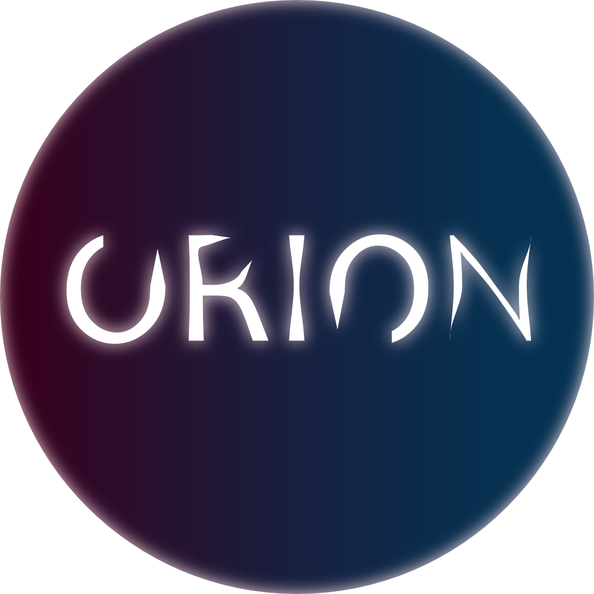

.note+p { /*next paragraph after 

*/
    padding: 8px 35px 8px 14px;
    margin-bottom: 20px;
    text-shadow: 0 1px 0 rgba(255,255,255,0.5);
    border-radius: 4px;
    color: #3a87ad;
    background-color: #d9edf7;
    border-color: #bce8f1;
}

.note+p:before { /*aditionally prepend `⚠ Note:` to message: */ 
    content: "⚠ Note:";
    font-weight: bold;
    display: block;
}

| :warning: <b> Note that this is connector is 'a work in progress' and therefore not ready to use in your production environment. </b> |
| --- |

<body>

       
    **NOTE**: Source [here](//developer.run)

 </body>

# O R I O N

ORION is a simple ASP.NET provisioning target API. 

  

## Table of contents

* [Prerequisites](#Prerequisites)
* [Using the API](#Using-the-API)
* [Release history](#Release-history)
* [Contributing](#Contributing)

## Prerequisites

- [ ] .NET Core 3.1 https://dotnet.microsoft.com/download/dotnet/3.1

## Using the API

### Endpoint overview

| Endpoint | Description               |
| -------- | ------------------------- |
| /        | Root endpoint for the API |
| /users   | user related actions      |

### Swagger

The API comes with a swagger interface served on the API root.

## Release history

Version 1.0.0 (2021-08-29)

- Initial release

## Contributing

Find a bug or have an idea! Open an issue or submit a pull request!

**Enjoy!**
